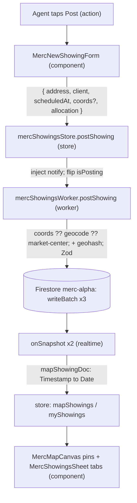
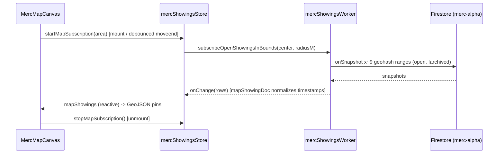

# Merc Module Guide

Extends the root `CLAUDE.md` — all root conventions apply (stack basics, code style,
plan-before-changes, ask clarifying questions one at a time, no div-itis, memory updates).
Below are Merc-only additions and overrides. Merc is a module inside this repo; it ships a
demo for Pearson Realty by **2026-09-11**.

## Canonical sources of truth

Read before any non-trivial Merc decision. If neither the ticket nor these docs answer a
question, stop and flag it — do not guess.

- Project Charter — https://linear.app/projectbluefire-merc/document/project-charter-65a656f8ef5a
- Architecture Decision Records (ADR-001…006) — https://linear.app/projectbluefire-merc/document/architecture-decision-record-adr-6c5d4376b9bd
- Tickets live in **Linear**, team key `MER`, project `Merc` — note Merc is on Linear, not
  Taiga like the rest of this repo.

## Merc-specific stack additions

On top of the root stack (Vue 3.5 `<script setup>`, Vite, Pinia, Vuetify 4, no TypeScript):

- Firebase **Cloud Functions** (managed backend / BaaS — no self-run server)
- Mapbox GL JS (`mapbox-gl`) for the map — rendering, routing, and geocoding (ADR-006). *(Leaflet was the original shell placeholder, since replaced.)*
- VueUse (`@vueuse/core`)
- Zod (runtime validation), day.js
- TanStack Query intentionally **not** used (poor fit with Firestore's `onSnapshot` model)

## Architectural non-negotiables (see the ADR doc)

- **Dedicated Merc Firebase project**, separate from this repo's existing Firebase —
  initialized as a named secondary app: `initializeApp(mercConfig, 'merc')`. Every
  `getAuth` / `getFirestore` call uses the Merc instance, never the repo's default. (ADR-005)
- **`brokerageId` on every core Firestore document**, day one. (ADR-005)
- **Financial records are append-only** — the ledger is an immutable event log; never mutate
  balances, never update or delete ledger entries. (ADR-002)
- **Real-time via Firestore `onSnapshot` + scoped queries**; no custom socket layer. (ADR-003)
- **Tiered identity verification**: broker-manager approval first; IDV/KYC deferred to
  Stripe Connect in Phase 4. (ADR-004)

## Module layout

- `src/pages/Merc.vue`, `src/components/merc/`, `src/stores/merc*Store.js`,
  `src/configs/merc*.js`. Routes namespaced `/merc/*`, registered in
  `src/schemas/routerLinksSchema.js`.
- Merc has its **own auth store** — never read the repo's `userStore` for Merc auth.

## Data flow (post-a-showing + realtime)

Realtime is Firestore `onSnapshot` (ADR-003) — there is no socket. The **worker** owns the listeners
and data-shape normalization; the **store** owns the reactive results + unsubscribe handles;
**components** stay presentational. An interactive, data-driven version of these diagrams is planned in
MER-52 — keep this section in sync when the flow changes.

Two listeners: the **map feed** (`subscribeOpenShowingsInBounds` — geohash-bounded open showings,
re-bounded on pan/zoom) and the **my feed** (`subscribeMyShowings` — `participantIds array-contains uid`,
driven by the auth watch). The lifecycle doc-block lives in `mercShowingsStore.js`.

## Git workflow (Merc)

- **No long-lived `merc` integration branch.** Merc ships into BlueFire like any other
  module: each ticket gets a branch `mer-<n>` (lowercase) cut **directly from `main`**, and
  its PR merges **directly into `main`**.
- **Claude never pushes and never opens PRs.** All pushing and PR creation are the user's;
  branches stay local on Claude's side until the user pushes them.

## Tagging

- Use `// TODO: MER-<n>: <note>` for Merc work — not `TG-xx` (that's Taiga, for the rest of
  the repo).

## Not Claude Code's to do

- Creating the Firebase project, enabling services (incl. Blaze / Cloud Functions), or
  generating or guessing credentials are human console actions. Wire code to the config;
  never fabricate secrets.
